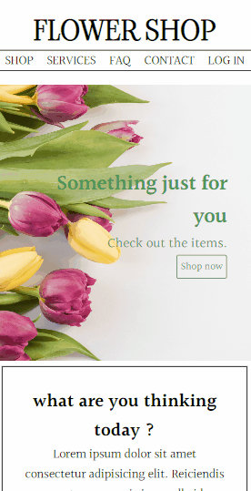

# Flower Shop 

This is a template of a Flower shop website. I decided to make it simple and responsive. It's divided by different sections you can go to by clicking on the menu or simply scrolling the page.  

[]

 [] 

## My process

### Built with

- HTML
- CSS
- JavaScript

### What I learned

During the development of this project I could apply the concepts I learned in HTML, CSS and JavaScript so far. In order to practice my skills this was created based on some mixed ideas I found on the internet.
I can emphasize a better understanding I've had through methods usage as forEach and addEventListener.
